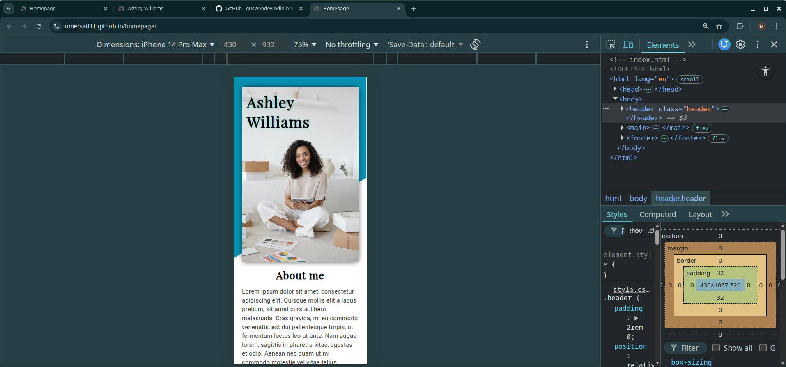
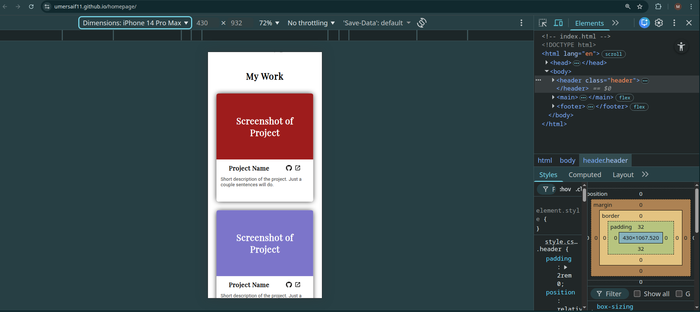
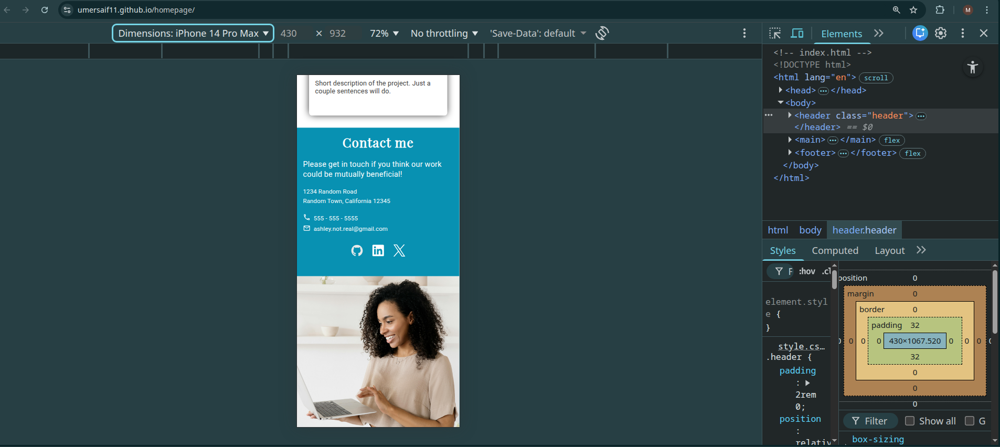
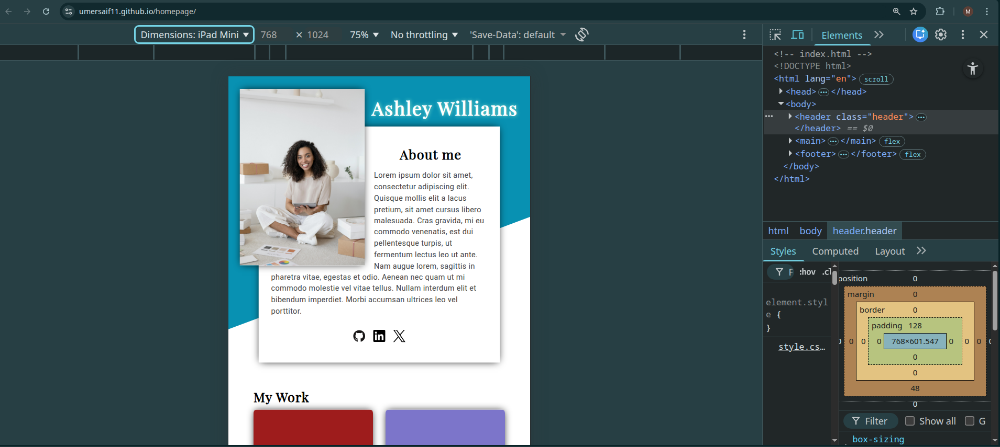
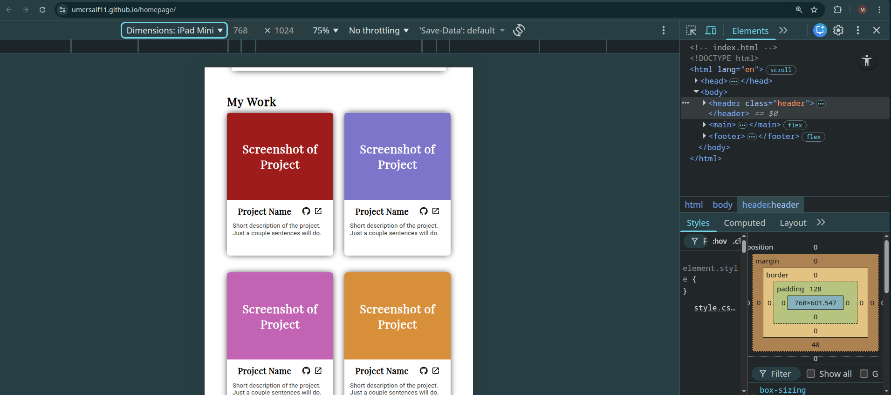
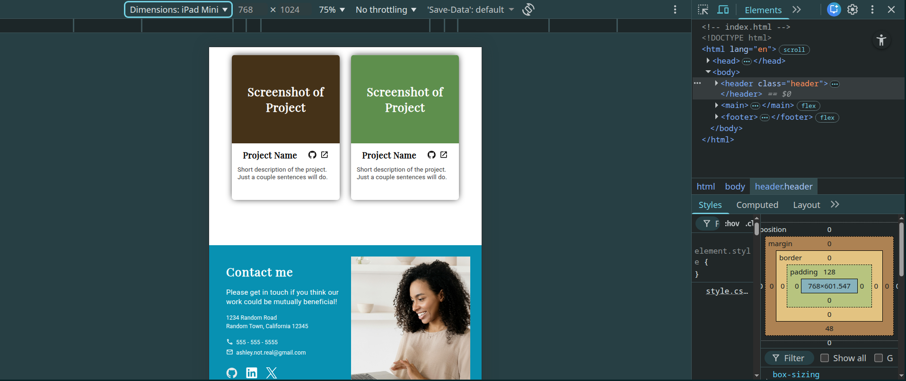
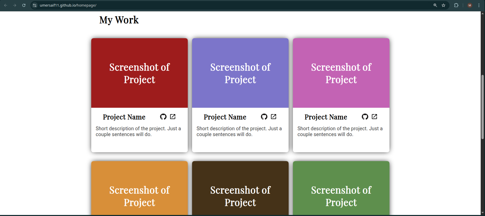
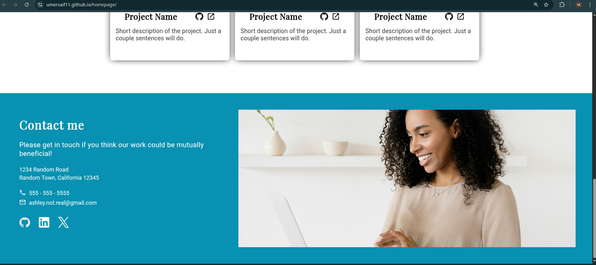

# 📝 Portfolio Homepage

# 🎨 Responsive Portfolio
[](https://umersaif11.github.io/homepage/)

## 💻 Tech Stack:

- **Languages:** HTML5, CSS3
- **Fonts:** Google Fonts (Playfair Display, Roboto)
- **Icons:** Devicon, Material Design Icons
- **Version Control:** Git & GitHub

---

## 🔍 Key Concepts Demonstrated

### Responsive Web Design (RWD):
The core of this project is adaptability. The layout fundamentally transforms across three breakpoints using CSS Media Queries:
* **Mobile First:** The default styles provide a stacked, vertical layout optimized for narrow screens.
* **Tablet (`min-width: 768px`):** Introduces complex positioning where the hero image floats out of the container to overlap the text.
* **Desktop (`min-width: 1024px`):** Adjusts the header constraints and modifies the footer split ratio (40/60) for wide screens.

### Advanced CSS Layouts:
* **CSS Grid:** Used in the `.projects-grid` to create a responsive card layout (`repeat(auto-fit, minmax(300px, 1fr))`) that wraps automatically without needing individual breakpoints for every card.
* **Flexbox:** Utilized for 1-dimensional alignment in the Navigation, Footer, and centering content within the Header.
* **CSS Shapes:** implemented `clip-path: polygon(...)` to create the dynamic angled blue background in the header section.

### Positioning & Overlaps:
* **Negative Margins:** To achieve the unique "floating image" effect in the header, I utilized negative margins (e.g., `margin: -1rem 0.5rem 0.2rem -6rem`) to break elements out of their standard document flow.
* **Absolute Positioning:** Used for the Hero Heading (`h1`) to position the name "Ashley Williams" precisely over the image or background depending on the screen size.

---

## 🎨 Key Features:

- **3-Stage Responsive Layout:**
    - **Mobile:** Clean vertical stack with a full-width diagonal background.
    - **Tablet:** The Hero image "breaks" the container boundary using floats and negative margins for a stylish overlap.
    - **Desktop:** Optimized spacing and alignment for large monitors (up to 1920px).
- **Interactive Project Gallery:** A grid of project cards with hover effects and responsive resizing.
- **Smart Typography:** Uses a combination of Serif (*Playfair Display*) for headings and Sans-Serif (*Roboto*) for body text to create visual hierarchy.
- **Sticky Footer:** A responsive footer that switches from a column layout (Mobile) to a row layout (Desktop) with specific flex-basis sizing.

---

## 🗣️ Description

This project is a pixel-perfect implementation of a responsive design brief provided by The Odin Project. The goal was to build a personal portfolio homepage that matches a specific design specification across desktop, tablet, and mobile viewports.

Unlike simpler layouts, this project required handling "out of the box" design elements. The header does not stay strictly within a grid; elements overlap, images float outside their containers, and background shapes slice through sections. This required a deep understanding of the CSS Box Model, positioning contexts, and media queries.

---

## ⛰️ Challenges Faced & Lessons Learned

### CSS Layout & Positioning:

1) #### The Header Overlap (Tablet View)
Matching the Tablet design where the image sits to the left and overlaps the white container was the hardest challenge.
* **Solution:** I used a combination of `float: left` on the `.hero-img` container and applied negative margins (`margin: -8rem 0 0 0`) to the image itself. This pulled the image upwards and outwards, creating the layered effect requested in the design brief.

2) #### The Diagonal Background
The design required a blue background that wasn't a simple rectangle—it needed a diagonal cut.
* **Solution:** Instead of using a background image, I used the CSS `clip-path` property on a `::before` pseudo-element. This allowed me to draw a polygon (`0 0, 100% 0, 100% 50%, 0 90%`) that creates the exact angle needed while remaining responsive to the viewport height.

3) #### Responsive Typography Positioning
The main heading ("Ashley Williams") had to move significantly between views. On Mobile, it sits inside the image container; on Tablet, it floats to the right; on Desktop, it adjusts again.
* **Solution:** I used `position: absolute` relative to the `.header` container. Inside the media queries, I manually adjusted the `top`, `left`, and `white-space` properties to ensure the text remained readable and correctly placed for each device size.

### Grid vs. Flexbox:

1) #### Project Gallery
I initially debated between Flexbox and Grid for the "My Work" section.
* **Lesson:** CSS Grid was the superior choice here. Using `grid-template-columns: repeat(auto-fit, minmax(300px, 1fr))` allowed the cards to perfectly fill the space. If I had used Flexbox, the last row of items might have centered awkwardly or stretched incorrectly. Grid kept everything perfectly aligned to the columns.

---

## 🖥️ Screenshots

**Mobile Header View**


**Mobile Projects View**


**Mobile Footer View**


**Tablet Header View**


**Tablet Projects View**


**Tablet Footer View**


**Desktop Header View**


**Desktop Projects View**


**Desktop Footer View**


---

## 🏃📜 Run This Project Locally

#### 1. Clone Repo

```bash
git clone https://github.com/umersaif11/homepage.git
```

#### 2. CD into repo

```bash
cd homepage
```